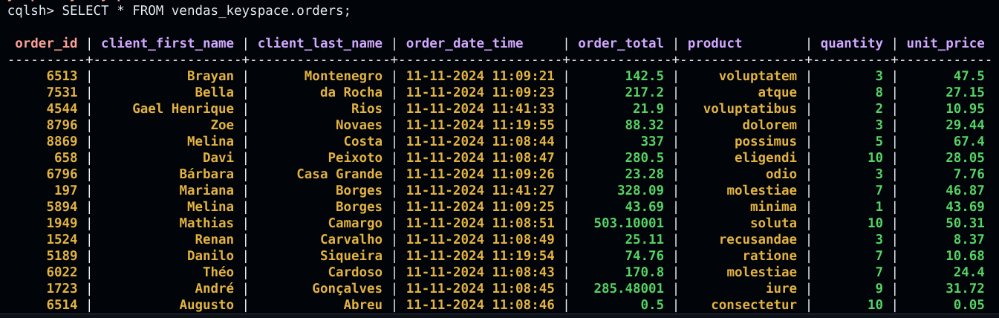

## Kafka exercise instructions:

The goal is to create a message producer for an e-commerce and a consumer to be used with Kafka. The data entries must be stored in a Cassandra table.

### Installing Kafka and preparing the environment
1. Download the .tgz file on https://kafka.apache.org/downloads and unzip it on a new directory 
 
2. open the *~/.bashrc* file and add the environment variables:

\# Kafka Environment Variables
export KAFKA_HOME=~/Documentos/kafka_2.13-3.8.0 (*use **your** Kafka directory path*)
export PATH=\$PATH:$KAFKA_HOME/bin

 

3. Create your code directory and, inside of it, install Python and its dependencies
- `sudo apt install python3.10 python3.10-venv python3.10-dev`
 

4. Install and activate virtual environment
- `python3.10 -m venv venv`
- `source venv/bin/activate`
 

5. Install the required libraries for the project
- `pip install Faker kafka-python pyspark`
 

6. Create the *requirements.txt* file
- `pip freeze > requirements.txt`

### Installing and setting up Cassandra
1. Update the system
- `sudo apt-get update`
- `sudo apt-get upgrade -y`
 

2. Add the Apache Cassandra repository to the package font list:
- `echo "deb [signed-by=/usr/share/keyrings/cassandra-archive-keyring.gpg] https://apache.jfrog.io/artifactory/cassandra-deb 41x main" | sudo tee /etc/apt/sources.list.d/cassandra.sources.list`
 

3. Add the public key:
- `curl https://downloads.apache.org/cassandra/KEYS | gpg --dearmor | sudo tee /usr/share/keyrings/cassandra-archive-keyring.gpg > /dev/null`
 

4. Update the system again:
- `sudo apt-get update`
 

5. Install Cassandra:
- `sudo apt-get install cassandra`
 

6. Open the Cassandra terminal:
- `cqlsh`
 

7. Create the keyspace:
- `CREATE KEYSPACE IF NOT EXISTS vendas_keyspace WITH replication = {'class': 'SimpleStrategy', 'replication_factor': 1};`
 

8. Create the table:
- `CREATE TABLE IF NOT EXISTS vendas_keyspace.orders (`
   `order_id text PRIMARY KEY,`
   `client_first_name text,`
   `client_last_name text,`
   `product text,`
   `quantity int,`
   `unit_price float,`
   `order_total float,`
   `order_date_time text`
   `);`

### To run the code 
**all the instructions must be done with the venv activated**

1. Initialize the Zookeeper:
- `$KAFKA_HOME/bin/zookeeper-server-start.sh $KAFKA_HOME/config/zookeeper.properties`
 

2. Initialize Kafka (open another terminal):
- `$KAFKA_HOME/bin/kafka-server-start.sh $KAFKA_HOME/config/server.properties`
 

3. Create a topic (open another terminal):
- `$KAFKA_HOME/bin/kafka-topics.sh --create --topic vendas --bootstrap-server localhost:9092 --partitions 1 --replication-factor 1`
- *ps: my topic name is **vendas**, if you change it, be sure to change all the "vendas" on the code to your new topic's name*
 

4. Run the consumer:
- `spark-submit --packages org.apache.spark:spark-sql-kafka-0-10_2.12:3.3.0,com.datastax.spark:spark-cassandra-connector_2.12:3.3.0 consumer.py`
 

5. Run the producer:
- `python3 producer.py`
 

6. On the **cqlsh terminal**, run the following command to view the table entries 
- `SELECT * FROM vendas_keyspace.orders;`

7. At the end, always turn off your Kafka application using the following commands on the active terminals:
- `ctrl + C`
- `deactivate`
