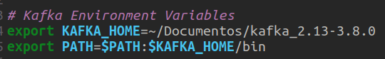

## Kafka exercise instructions:

The goal is to create a message producer for an e-commerce and a consumer to be used with Kafka.

### Installing Kafka and preparing the environment
1. Download the .tgz file on https://kafka.apache.org/downloads and unzip it on a new directory 
 
2. open the *~/.bashrc* file and add the environment variables:

\# Kafka Environment Variables
export KAFKA_HOME=~/Documentos/kafka_2.13-3.8.0 (*use **your** Kafka directory path*)
export PATH=\$PATH:$KAFKA_HOME/bin

 

3. Create your code directory and, inside of it, install Python and its dependencies
- `sudo apt install python3.10 python3.10-venv python3.10-dev`
 

4. Install and activate virtual environment
- `python3.10 -m venv venv`
- `source venv/bin/activate`
 

5. Install the required libraries for the project
- `pip install Faker kafka-python pyspark`
 

6. Create the *requirements.txt* file
- `pip freeze > requirements.txt`

### To run the code 
**all the instructions must be done with the venv activated and on the code directory**

1. Initialize the Zookeeper:
- `$KAFKA_HOME/bin/zookeeper-server-start.sh $KAFKA_HOME/config/zookeeper.properties`
 

2. Initialize Kafka (open another terminal):
- `$KAFKA_HOME/bin/kafka-server-start.sh $KAFKA_HOME/config/server.properties`
 

3. Create a topic (open another terminal):
- `$KAFKA_HOME/bin/kafka-topics.sh --create --topic vendas --bootstrap-server localhost:9092 --partitions 1 --rplication-factor 1`
- *ps: my topic name is **vendas**, if you change it, be sure to change all the "vendas" on the code to your new topic's name*
 

4. Run the consumer:
- `python3 consumer.py`
 

5. Run the producer:
- `python3 producer.py`
 

6. At the end, always turn off your Kafka application using the following commands on the active terminals:
- `ctrl + C`
- `deactivate`